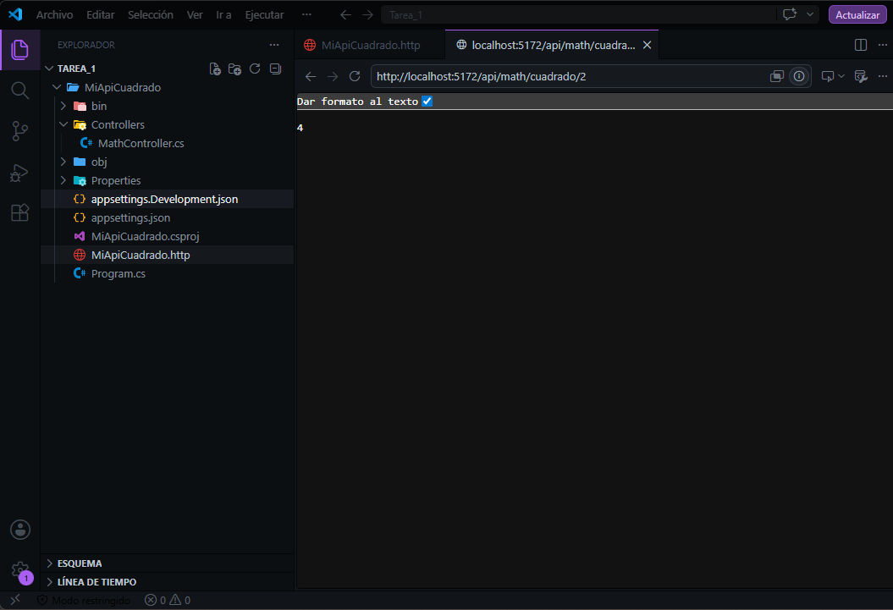
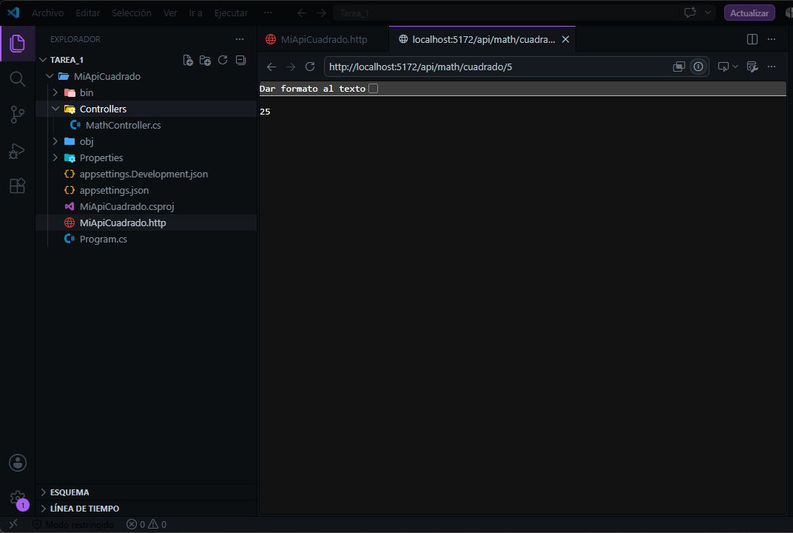
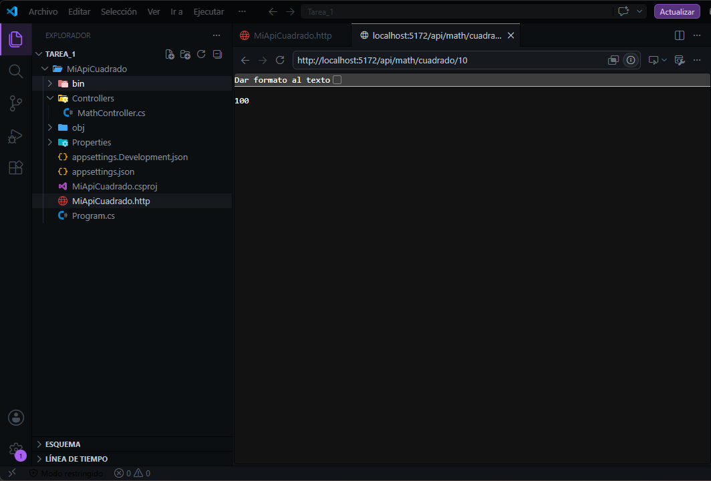
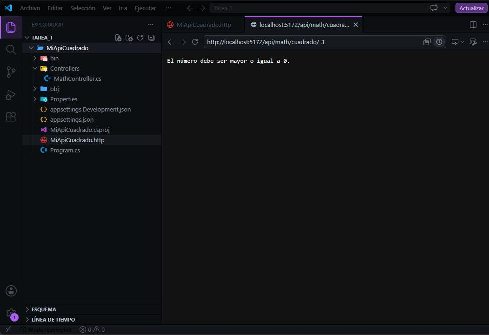
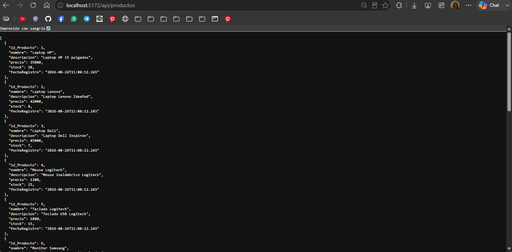

# Api #1 Obtener El Cuadrado De Un Número

## Api de calcular el cuadrado de un número
Es una Api web en .Net que recibe un número y devuelve el cuadrado.

## Entre las características:
* El Endpoint Get (`/api/Math/cuadrado/numero`) que es para calcular el cuadrado de un número, en /numero ingresar el numero a elevar.
* Validación para evitar números negativos.

## Evidencia de las pruebas locales:
Capturas mostrando que la Api funciona correctamente:

### Prueba 1 con el número 2

### Prueba 2 con el número 5

### Prueba 3 con el número 10

### Prueba 4 con el número negativo -3

# Api #2 Retorno De Datos desde Base de Datos

## Api De Obtener Lista De Producto De Base de Datos Mediante Somee Y Conexión con Dapper

Es una Api web en .Net que se conecta a la base de datos  Sql Server en la nube con somee.com conectada mediante Dapper y devuelve la lista de productos.

## Entre las características:
* El Endpoint Get (`/api/productos`) lista de todos los productos.
* Conexión a la base de datos alojada en Somee utilizando Dapper.
* Arquitectura en capas

## Evidencia del Funcionamiento:
Capturas mostrando que la Api funciona correctamente:

*Prueba del endpoint mostrando los productos en JSON:*

##
*Elaborado por: Mariela García Tejada*